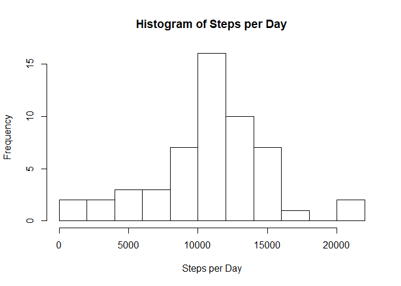
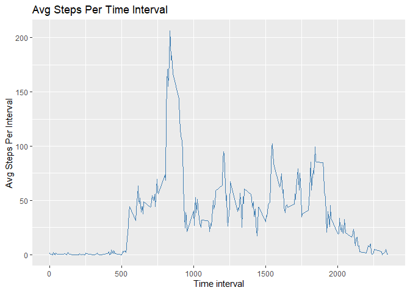
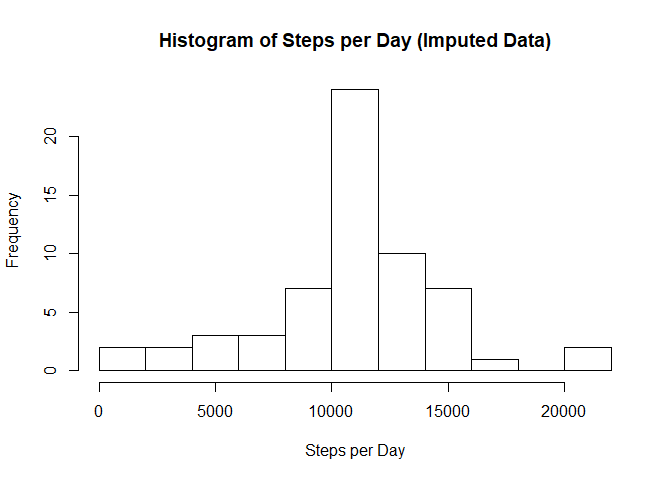
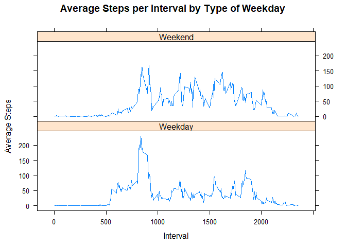

## Loading and preprocessing the data

```r
options(scipen=999)
if(!exists('act')) {
    act <- read.csv("activity.csv", header = TRUE, sep = ",")  
}
act$date <- as.Date(act$date, "%Y-%m-%d")
```
## What is mean total number of steps taken per day?

```r
spd <- aggregate(act$steps, by=list(act$date), FUN=sum)

hist(spd$x, breaks = 12, main = paste("Histogram of Steps per Day"), xlab = "Steps per Day")
```

<!-- -->

```r
mean <- mean(spd$x, na.rm = T)
med <- median(spd$x, na.rm = T)
```
Steps per Day Stats

Mean: 10766.19

Median: 10765

## What is the average daily activity pattern?

```r
library(data.table)
```

```
## Warning: package 'data.table' was built under R version 3.6.1
```

```r
DT <- as.data.table(act)
adt <- DT[, mean(na.omit(steps)), by=interval]

library(ggplot2)
require("scales")
```

```
## Loading required package: scales
```

```
## Warning: package 'scales' was built under R version 3.6.1
```

```r
ggplot(adt, aes(x =interval, y = V1)) + 
  geom_line(stat = "identity", colour="Steelblue") +
  ggtitle("Avg Steps Per Time Interval") +
  labs(x="Time interval", y="Avg Steps Per Interval")
```

<!-- -->

```r
maxavg <- adt[which.max(adt$V1),]
```

Which 5-minute interval, on average across all the days in the dataset, contains the maximum number of steps?
Answer:  The Interval 835 contains the maximum number of steps with on average 206.1698113 steps.


## Imputing missing values

###Calculate and report the total number of missing values in the dataset (i.e. the total number of rows with NA

```r
miss <- act[is.na(act$steps),]
full <- act[!is.na(act$steps),]
```
There are 2304 missing records.

###Devise a strategy for filling in all of the missing values in the dataset. The strategy does not need to be sophisticated. For example, you could use the mean/median for that day, or the mean for that 5-minute interval, etc.

```r
# imputed dataframe
imputed <- act

# na index bool vector
isna <- is.na(act$steps)

# imputing strategy: fill na values with average steps values of the same interval
avg <- tapply(full$steps, full$interval, mean, na.rm=T, simplify=T)
imputed$steps[isna] <- avg[as.character(imputed$interval[isna])]

# steps per day imputed
imputed.spd <- aggregate(imputed$steps, by=list(imputed$date), FUN=sum)

hist(imputed.spd$x, breaks = 12, main = paste("Histogram of Steps per Day (Imputed Data)"), xlab = "Steps per Day")
```

<!-- -->

```r
imp.mean <- mean(imputed.spd$x)
imp.med <- median(imputed.spd$x)
```
Steps per Day Imputed Stats

Mean: 10766.19

Median: 10766.1886792

## Are there differences in activity patterns between weekdays and weekends?


```r
imputed$wd <- as.factor(weekdays(imputed$date))

endorday <- data.frame(dayname = c('Monday', 'Tuesday', 'Wednesday', 'Thursday', 'Friday', 'Saturday', 'Sunday'), factor = c('Weekday','Weekday','Weekday','Weekday','Weekday','Weekend','Weekend'))

temp <- imputed[,4]
temp <- sapply(temp, function(x) endorday$factor[match(x, endorday$dayname)])
imputed[,4] <- temp
rm(temp)

#plotting
intavg <- aggregate(imputed$steps,by=list(imputed$interval, imputed$wd),mean)

library(lattice)
xyplot(intavg$x ~ intavg$Group.1|intavg$Group.2, main="Average Steps per Interval by Type of Weekday",xlab="Interval", ylab="Average Steps",layout=c(1,2), type="l")
```

<!-- -->

###Summarizing the Chart:

In the Intervall up to 10 o'clock there are on average more steps measured on weekdays with a peak shortly before that, while after 10' clock there is on average more step activity measured on weekends than on weekdays.
